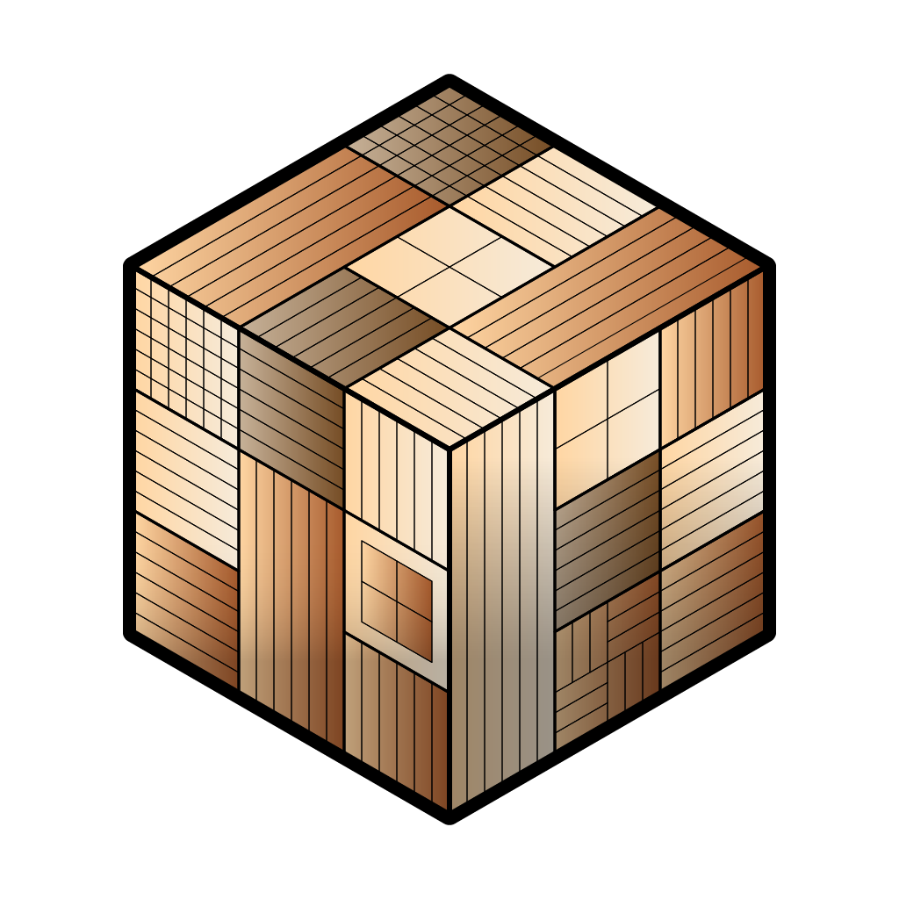

# kist Brand Assets

Official brand assets for the kist project.

## Logo

  

### Logo Files

| File | Format | Usage |
| ------ | -------- | ------- |
| [kist.png](src/logo/kist.png) | PNG | General use, documentation |

## Colors

### Primary Palette

| Color | Hex | RGB | Usage |
| ------- | ----- | ----- | ------- |
| Kist Brown | `#5e4d34` | `94, 77, 52` | Primary brand color |
| Kist Cream | `#f5f2ed` | `245, 242, 237` | Background, light surfaces |
| Kist Dark | `#2c2416` | `44, 36, 22` | Dark mode, text |

### Accent Colors

| Color | Hex | Usage |
| ------- | ----- | ------- |
| Success | `#4caf50` | Success states |
| Warning | `#ff9800` | Warning states |
| Error | `#f44336` | Error states |
| Info | `#2196f3` | Information |

## Typography

### Primary Font

- **Font Family**: Inter, system-ui, sans-serif
- **Weights**: 400 (Regular), 500 (Medium), 600 (Semibold), 700 (Bold)

### Monospace Font

- **Font Family**: JetBrains Mono, Fira Code, monospace
- **Usage**: Code snippets, terminal output

## Usage Guidelines

### Do

- Use official logo files without modification
- Maintain minimum clear space around logo
- Use appropriate color versions for background contrast
- Link to [getkist.com](https://www.getkist.com) when using the logo

### Don't

- Stretch or distort the logo
- Change logo colors
- Add effects (shadows, gradients, etc.)
- Use on busy backgrounds without sufficient contrast

## Download

All brand assets are available in the [src/](src/) directory.

## License

The kist logo and brand assets are © Scape Press. Usage is permitted for:

- Documentation referencing kist
- Blog posts and articles about kist
- Integration showcases

For other uses, please contact [info@scape.press](mailto:info@scape.press).

---

  <b>Made with ❤️ by <a href="https://www.scape.press" target="_blank">Scape Press</a></b>

